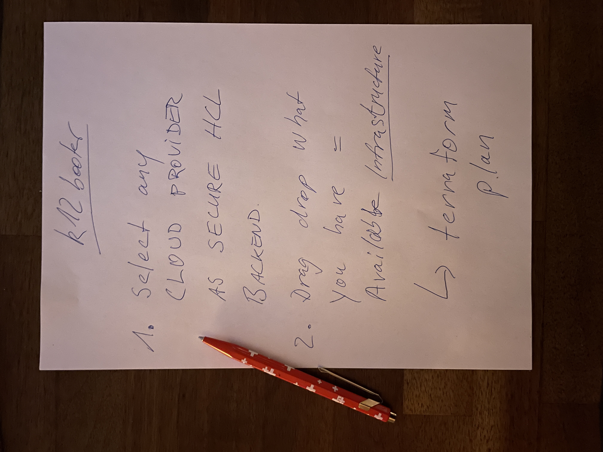

# k12-booter

## PROJECT WITH REDUCED AMBITION DUE TO TWITTER.COM SUSPENSION.
Do not complain about CRIMINAL OLAF SCHOLZ #CUMEX on Twitter.
Germany has severe problems with online censorship.
While true large scale crimes are on the rise.
The previous version of this document contained a more clear
statement, but it does not help anyway. What could help schools,
or supposed to do so, is outlined above.

# Introduction

Frei nach dem Motto: "Rom ist euer Pruter" - A GUI to set up K12 macOS labs, i.e. one or more computer.

## To restore the educational sector im Germany

... we first must conduct death penalty on Kanzler Olaf Scholz
for his yet-unpunished CUMEX crime. CUMEX is the biggest ORGANISED
tax fraud in German history. After robbing banks in Hamburg,
Scholz did the same via Deutsche Bank - adjust Law to ensure
that the crime is only minimally punished - and then commit it,
1000s times.

If he is NOT punished with death penalty --
I forbid usage in the German Nazi land.
I do not support Nazis. So clean your country or die stupid.
Your choice.

## Status

Intial #Pamphlet

Second thought

## What will k12-booter do, maybe?

It's a GUI app. Native. For PC and Mac. Same. Qt or whatever. Smooth. Intuitive. Non-VERBOSE.

1. On first start-up, meaning NO LOCAL CONFIG FILES FOUND, an Assistant or, even better,
   a wizard will lead one, two or three teachers (or so) into the adventure of setting
   up a computer lab, securely AND easily. By integrating a HELL of OpenSource components, smoothly.
   The assistant will

   1. Collect basic information about school and available infrastructure
   2. Provide a list of government-supported cloud providers for secure data storage
   3. Will aid in cloud account setup as far as possible, best practices implemented by aws/google/yandex/huaweicloud
   4. Will ensure master account data is stored on encrypted USB sticks
   5. Will use KMS or equivalent EXCLUSIVELY. One central keystore, logging on access.
   6. Do further security-related ground work and DOCUMENT it automatically (HCL => S3 or so)

2. k12booter aids further in account setup, based on ROLES. Every school has some secretaries.
   We don't want creative paths here, intruders would find "hidden" files anyway. /home it is, say.

3. k12booter supports ANY kind of IT infra available, even the future ones, then. Cool. Meaning:
   After supplying data, k12booter instructs the user how to automate setup of these devices,
   providing all options available; example: Replaceable disks in a set up RaspberryPi s? Then
   support imaging the CF cards for manual distribution. Network boot environment using Cisco
   switches? Help setting up DHCP helpers (that CAN be a Mac thing if crossing network boundries).
   The complexity behind it must be hidden from the user. In conclusion, EXISTING OSS tools
   will be used -- but we replace their BAZILLIONS of horrible CLI interfaces with ONE
   well-INTEGRATED interface.

4. Assuming a fleet of Macs or PCs running Linux or Windows - k12booter shall then help to
   MAINTAIN the highes level of workstation security possible by
   1. Implementing ConfigManagement so changes can be detected, reversed ...
   2. Educating users that local "root" is NOT wanted, unless debugging OS/HW issues;
      Changes to system configuration MUST GO THROUGH the config management system.
   3. Installing [Telegraf](https://github.com/influxdata/telegraf) or equivalent on
      workstations, if needed, extended to monitor OS patch-level #SecurityUpdates.
      Accordingly, k12booter aids in setup of Prometheus and Grafana including
      matching dashboards accordingly. For government reporting, digest data is
      gathered and submitted to S3 buckets as defined by NSACyber/FBI.
   4. Ensuring userland applications are up-to-date as well. Simple on debian, ubuntu,
      RedHat - any good Linux distro. On Mac: [homebrew](https://brew.sh/), [munki](https://github.com/munki/munki). On Windows: [chocolatey](https://chocolatey.org/). The
      selection of packages is the only COMMON thing users get to see here.
      Nobody wants to explain people why `apt` is good while an `APT` es evil.
      We CAN agree on a CURATED LIST of software, SCHOOLS - pupils SHOULD take a look at.
      Starting with FUN things like Blender, Image editing, ... etc.

5. Pupil view - What's new.
  1. Every kid now has ONE cloud account, enabling SingleSign-On for all further EDU services.
  2. Each Teacher has one (cloud drive) folder per class it's taking care of, and each pupil has those shares mounted/available for document sharing.
  3. More to be defined by [Department of Homeland security](https://www.dhs.gov/)

6. Teacher documentation - Output, outcome - final stage ...
  1. Via governmental online portal, visualising current state known #Zensus #Statistics #PISA #CVE #ITSEC
  2. Teachers can differntiate like ISO something security, cofidentiality levels - and corresponding storage locations.
  3. Point 2 impacts (automated) SHARING of information with third parties, including e.g. the school's website.
  4. Yes, the school needs a website today. For the city inhabitants. The school may want to show the world its face,
     but most of content is irrelevant to others. Then, INTRUDERS come into play; people looking for security issues
     to hijack the infrastructure - maybe from the other end of the world, maybe to install crypto miners. Most likely,
     you will not notice without our help. Long story short, we WILL have walls here, to avoid useless traffic that
     should lead to denial of access in the end anyway. You can always request any information from authorities though.
     The perimeter needs to be defined here I guess, although it might be clear to some or the wrong term. And then
     networking security, at the PROVIDER LEVEL. Schools are maybe the ONLY parties where web filters could make sense?
  5. This is very drafted. Sorry. Good night.

I might want to rethink this. Alone is a bit boring. PEACE.
References: e.g. This [tweet](https://twitter.com/x4e_ch/status/1638711985012441088)

## One more TODO list 

- At startup, figure out locale, try to guess country, select correct translation.
- Provide "Welcome" message translated to all languages so all I18n files exist ... :shrug:
- [HTML form docs MDN](https://developer.mozilla.org/en-US/docs/Web/HTML/Element/form) #AutoComplete
  Any data available in choosers should be feed to an application-wide [bleve](https://github.com/blevesearch/bleve) instance.
  That could then serve nicely as source for autocomplete/sugester/type-ahead in form fields.
- `input_html.go` - support HTML checkboxes (and radio buttons, yes)
- formgenerator: give each element (that earns it) a tabindex.

- k12booter could serve as info terminal. it is aware of infra details, so ..
  - help lecturerers: "How to connect my PC to the beamer in room X?",
  - the above, believe it or not, requires support at universities, too.
  - "How to share a work file with class 7", "How to message colleagues"...

I18N ...

- imagine k12booter was a globally translated app, availble in any school (as it is FREE)...
- roaming teachers from one country to another would find a known working-environment, with "cloud" behind abstracted away, ideally
- k12booter should be able to switch locale (display language) at runtime => gives globally consistent experience (well LTR/RTL...)

## Meanwhile ...

<iframe width="560" height="315" src="https://www.youtube.com/embed/WHm0_qGdhTw" title="YouTube video player" frameborder="0" allow="accelerometer; autoplay; clipboard-write; encrypted-media; gyroscope; picture-in-picture; web-share" allowfullscreen></iframe>

<iframe width="560" height="315" src="https://www.youtube.com/embed/IwHotyPnSgc" title="YouTube video player" frameborder="0" allow="accelerometer; autoplay; clipboard-write; encrypted-media; gyroscope; picture-in-picture; web-share" allowfullscreen></iframe>

<iframe width="560" height="315" src="https://www.youtube.com/embed/chDDhwsynVg" title="YouTube video player" frameborder="0" allow="accelerometer; autoplay; clipboard-write; encrypted-media; gyroscope; picture-in-picture; web-share" allowfullscreen></iframe> 

This project is to be completed by Apple.

<blockquote class="twitter-tweet">
Es gibt so viele Gründe, dass Apple hier liefern muss.  Einer?<a href="https://twitter.com/hashtag/DeveloperCertificate?src=hash&amp;ref_src=twsrc%5Etfw">#DeveloperCertificate</a> <a href="https://twitter.com/hashtag/MarktZugang?src=hash&amp;ref_src=twsrc%5Etfw">#MarktZugang</a> <a href="https://twitter.com/hashtag/Entwickler?src=hash&amp;ref_src=twsrc%5Etfw">#Entwickler</a> <a href="https://twitter.com/hashtag/Barriere?src=hash&amp;ref_src=twsrc%5Etfw">#Barriere</a> <a href="https://twitter.com/IntlCrimCourt?ref_src=twsrc%5Etfw">@IntlCrimCourt</a> <a href="https://twitter.com/hashtag/Kosten?src=hash&amp;ref_src=twsrc%5Etfw">#Kosten</a> <a href="https://twitter.com/hashtag/Cost?src=hash&amp;ref_src=twsrc%5Etfw">#Cost</a>   Ein Zweiter?<a href="https://twitter.com/NSACyber?ref_src=twsrc%5Etfw">@NSACyber</a> <a href="https://twitter.com/hashtag/Security?src=hash&amp;ref_src=twsrc%5Etfw">#Security</a> <a href="https://twitter.com/hashtag/Privacy?src=hash&amp;ref_src=twsrc%5Etfw">#Privacy</a> <a href="https://twitter.com/hashtag/School?src=hash&amp;ref_src=twsrc%5Etfw">#School</a> <a href="https://twitter.com/hashtag/Kids?src=hash&amp;ref_src=twsrc%5Etfw">#Kids</a> <a href="https://twitter.com/hashtag/Data?src=hash&amp;ref_src=twsrc%5Etfw">#Data</a>   Ein Dritter? Ich brauche einen Job, Tim. ODER Geld, auch gut. ☮️
&mdash; Jan Arno Hacker - #FreeAssange Pegasus Premium (@kwikgo) <a href="https://twitter.com/kwikgo/status/1636777680312975390?ref_src=twsrc%5Etfw">March 17, 2023</a></blockquote> 

# Free Julian Assange NOW 

Peace.
